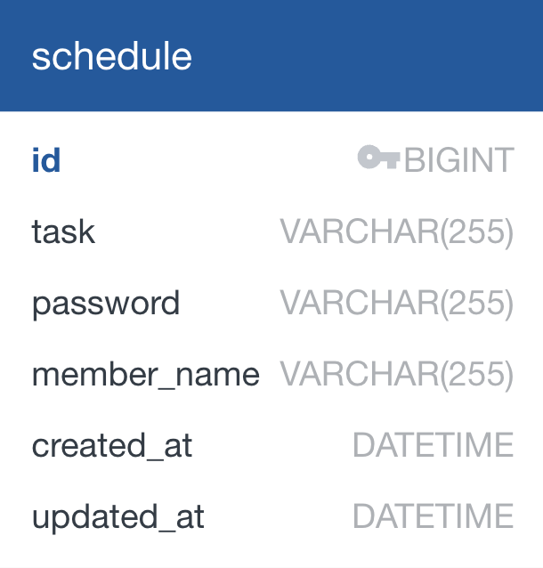
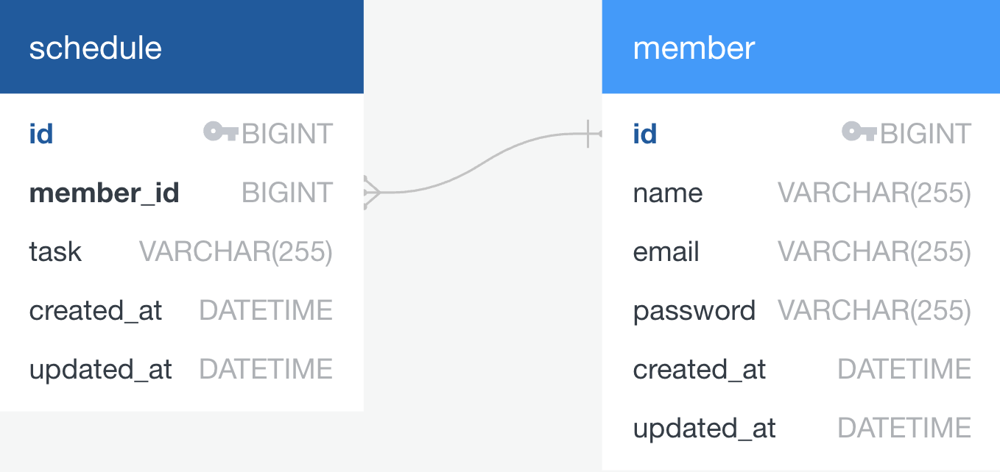

# Schedule

## 필수 과제

### API

<div style="overflow-x: auto;">

| **Method** | **Endpoint**         | **Description**                     | **Parameters**                                                                            | **Request Body**                                                                                                 | **Response**                                                                                                                                     | **Status Code** |
|------------|----------------------|-------------------------------------|-------------------------------------------------------------------------------------------|------------------------------------------------------------------------------------------------------------------|--------------------------------------------------------------------------------------------------------------------------------------------------|-----------------|
| `POST`     | `/schedules`         | 일정 생성                           | 없음                                                                                        | `{ "task": string, "password": string, "memberName": string }`                                                   | `{ "id": long, "task": string, "password": string, "memberName": string, "createdAt": string, "updatedAt": string }`                              | `200 OK`        |
| `GET`      | `/schedules`         | 일정 목록 조회                      | Query: <br> - `updatedDate` (예: "2025-02-02", `optional`)<br> - `memberName` (`optional`) | 없음                                                                                                             | `[ { "id": long, "task": string, "password": string, "memberName": string, "createdAt": string, "updatedAt": string }, ... ]`                      | `200 OK`        |
| `GET`      | `/schedules/{id}`    | 일정 단건 조회                       | Path: <br> - `id`                                                                         | 없음                                                                                                             | `{ "id": long, "task": string, "password": string, "memberName": string, "createdAt": string, "updatedAt": string }`                               | `200 OK`        |
| `PUT`      | `/schedules/{id}`    | 일정 수정                            | Path: <br> - `id`                                                                         | `{ "task": string, "password": string, "memberName": string }`                                                   | `{ "id": long, "task": string, "password": string, "memberName": string, "createdAt": string, "updatedAt": string }`                               | `200 OK`        |
| `DELETE`   | `/schedules/{id}`    | 일정 삭제                           | Path: <br> - `id` <br> Query: <br> - `password` (`mandatory`)                              | 없음                                                                                                             | 없음                                                                                                                                             | `200 OK`        |

</div>

<br>

### SQL

```sql
CREATE TABLE schedule (
      id BIGINT AUTO_INCREMENT PRIMARY KEY,
      task VARCHAR(255) NOT NULL,
      password VARCHAR(255) NOT NULL,
      member_name VARCHAR(255) NOT NULL,
      created_at DATETIME NOT NULL,
      updated_at DATETIME NOT NULL
)
```

<br>

### ERD



> `?` 표시가 없는 경우 `NOT NULL` 입니다. (ex. `DATETIME?` 일 경우 nullable 필드)

<br>

---

<br>

## 도전 과제

### API

#### Members

<div style="overflow-x: auto;">

| **Method** | **Endpoint**       | **Description**             | **Parameters**                                              | **Request Body**                                                                                  | **Response**                                                                                                                                       | **Status Code** |
|------------|--------------------|-----------------------------|-------------------------------------------------------------|---------------------------------------------------------------------------------------------------|----------------------------------------------------------------------------------------------------------------------------------------------------|-----------------|
| `POST`     | `/members`         | 회원 생성                   | 없음                                                          | `{ "name": string, "email": string, "password": string }`                                          | `{ "id": long, "name": string, "email": string, "password": string, "createdAt": string, "updatedAt": string }`                                     | `200 OK`        |
| `GET`      | `/members/{id}`    | 회원 단건 조회              | Path: <br> - `id`                                           | 없음                                                                                              | `{ "id": long, "name": string, "email": string, "password": string, "createdAt": string, "updatedAt": string }`                                     | `200 OK`        |
| `PUT`      | `/members/{id}`    | 회원 수정                   | Path: <br> - `id`                                           | `{ "name": string, "password": string }`                                                           | `{ "id": long, "name": string, "email": string, "password": string, "createdAt": string, "updatedAt": string }`                                     | `200 OK`        |
| `DELETE`   | `/members/{id}`    | 회원 삭제                   | Path: <br> - `id` <br> Query: <br> - `password` (mandatory) | 없음                                                                                              | 없음                                                                                                                                               | `200 OK`        |

</div>

#### Schedules

<div style="overflow-x: auto;">

| **Method** | **Endpoint**              | **Description**                 | **Parameters**                                                                                                                                                 | **Request Body**                                                                                                  | **Response**                                                                                                                                                          | **Status Code** |
|------------|---------------------------|---------------------------------|----------------------------------------------------------------------------------------------------------------------------------------------------------------|-------------------------------------------------------------------------------------------------------------------|-----------------------------------------------------------------------------------------------------------------------------------------------------------------------|-----------------|
| `POST`     | `/schedules`              | 일정 생성                       | 없음                                                                                                                                                             | `{ "task": string, "memberEmail": string, "password": string }`                                                  | `{ "id": long, "task": string, "memberEmail": string, "password": string, "createdAt": string, "updatedAt": string }`                                                     | `200 OK`        |
| `GET`      | `/schedules`              | 일정 목록 조회                | Query: <br> - `updatedDate` (예: "2025-02-02", `optional`) <br> - `memberName` (`optional`) <br> - `memberId` (`optional`) <br> - `page` (default: 1) <br> - `size` (default: 10) | 없음                                                                                                              | 페이지 형태의 `{ "content": [ { "id": long, "task": string, "memberEmail": string, "password": string, "createdAt": string, "updatedAt": string }, ... ], "pageable": {...}, ... }` | `200 OK`        |
| `GET`      | `/schedules/{id}`         | 일정 단건 조회                | Path: <br> - `id`                                                                                                                                              | 없음                                                                                                              | `{ "id": long, "task": string, "memberEmail": string, "password": string, "createdAt": string, "updatedAt": string }`                                                     | `200 OK`        |
| `PUT`      | `/schedules/{id}`         | 일정 수정                     | Path: <br> - `id`                                                                                                                                              | `{ "task": string, "memberEmail": string, "password": string }`                                                   | `{ "id": long, "task": string, "memberEmail": string, "password": string, "createdAt": string, "updatedAt": string }`                                                     | `200 OK`        |
| `DELETE`   | `/schedules/{id}`         | 일정 삭제                     | Path: <br> - `id` <br> Query: <br> - `memberName` (`mandatory`) <br> - `password` (`mandatory`)                                                                    | 없음                                                                                                              | 없음                                                                                                                                                                   | `200 OK`        |

</div>

<br>

### SQL

```sql
CREATE TABLE member (
                        id BIGINT AUTO_INCREMENT PRIMARY KEY,
                        name VARCHAR(255) NOT NULL,
                        email VARCHAR(255) NOT NULL,
                        password VARCHAR(255) NOT NULL,
                        created_at TIMESTAMP NOT NULL,
                        updated_at TIMESTAMP NOT NULL
);

CREATE TABLE schedule (
                          id BIGINT AUTO_INCREMENT PRIMARY KEY,
                          member_id BIGINT NOT NULL,
                          task VARCHAR(255) NOT NULL,
                          created_at TIMESTAMP NOT NULL,
                          updated_at TIMESTAMP NOT NULL,
                          CONSTRAINT fk_member FOREIGN KEY (member_id) REFERENCES MEMBER (id)
);
```

<br>

### ERD



> `?` 표시가 없는 경우 `NOT NULL` 입니다. (ex. `DATETIME?` 일 경우 nullable 필드) 
